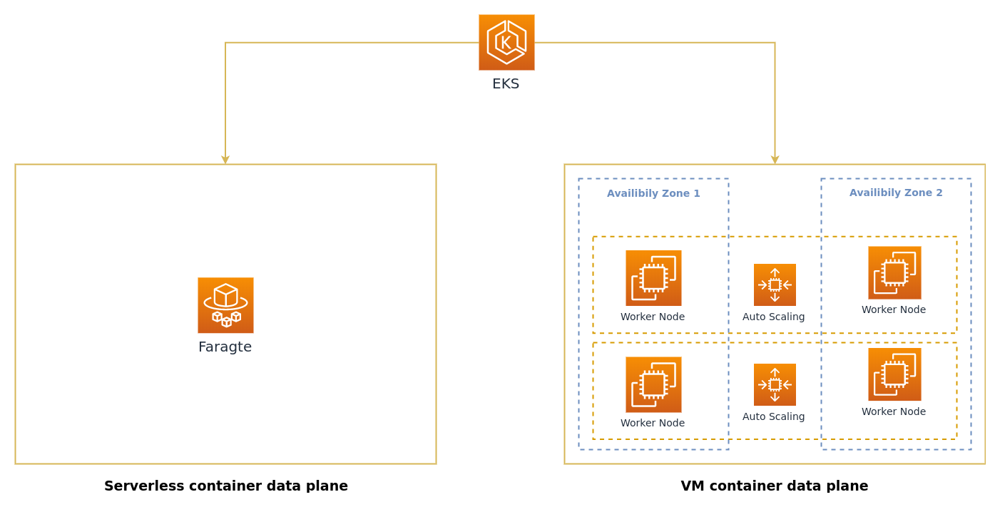

# New Cluster
**The goal of this chapter is to create you first EKS cluster that will allow you to run pods both on EC2 and on Fargate.**

> :warning: **EKS on Fargate is currently not available in all regions, so make sure you use one of the following regions**: US East (N. Virginia), US East (Ohio), Europe (Ireland), and Asia Pacific (Tokyo)

We will be creating our EKS cluster with the tool [eksctl](https://eksctl.io/) as it automates the majority of the work. We want to create a "mixed" EKS cluster that allows running pods both on Fargate and on EC2. The diagram below shows how the scheduler in EKS can decide where to run a pod.


By default if you were to run the command `eksctl create cluster` the tool would create an EKS cluster with 2x `m5.large` EC2 worker nodes. That only gets us half way there as Fargate will not be enabled. You enable scheduling pods on Fargate by creating a [Fargate Profile](https://docs.aws.amazon.com/eks/latest/userguide/fargate-profile.html). We will go into detail later on how these profiles work. For now all you need to know is that it specifies a namespace and an optional label selector for pods that should run on Fargate.

`eksctl` takes a configuration file as input when creating a cluster to allow you to configure the VPC, region, node groups, etc. We will mainly be using two of these fields, `managedNodeGroups` and `fargateProfiles`. The former configures the EKS managed nodes groups. This workshop will not go into the details of managed nodes groups, all you need to know is that it will create EC2 instances that will be joined to your EKS cluster. If you want more information please refer to the [documentation](https://docs.aws.amazon.com/eks/latest/userguide/managed-node-groups.html). The latter configures the Fargate profile as was previously described. Inspecting the content of the `cluster.yaml` file located in the chapters directory, it can be concluded that a single node group is going to be created with the instance type `t2.large` and a desired capacity of two. Additionally a Fargate profile will be created that will schedule pods on Fargate that are created in the `default` namespace and have the label `env: fargate`.
```yaml
apiVersion: eksctl.io/v1alpha5
kind: ClusterConfig

metadata:
  name: workshop
  region: eu-west-1

managedNodeGroups:
  - name: managed-ng-1
    instanceType: t2.large
    desiredCapacity: 2
    maxSize: 4

fargateProfiles:
  - name: default
    selectors:
      - namespace: default
        labels:
          env: fargate
```

Create the cluster, make sure that you are located in the correct directory. It may take up to 15 minutes for the cluster to be created.
```shell
cd 1_new_cluster
eksctl create cluster -f cluster.yaml
```

Your kubeconfig should be automatically configured by `eksctl`. Check that your cluster is up and running by getting its nodes, you should get a similar output as below with two nodes in the cluster. You may be wondering where the Fargate nodes are, don't worry we will get to that in the next chapter.
```shell
$ kubectl get nodes
NAME                                                    STATUS   ROLES    AGE   VERSION
ip-192-168-60-78.eu-west-1.compute.internal             Ready    <none>   12h   v1.14.7-eks-1861c5
ip-192-168-7-1.eu-west-1.compute.internal               Ready    <none>   12h   v1.14.7-eks-1861c5
```

Congratulations! You now have a EKS cluster running both on EC2 and Fargate. Lets do something with it, so make sure that you do not remove the cluster.

[Next Chapter](../2_deploy_application)
