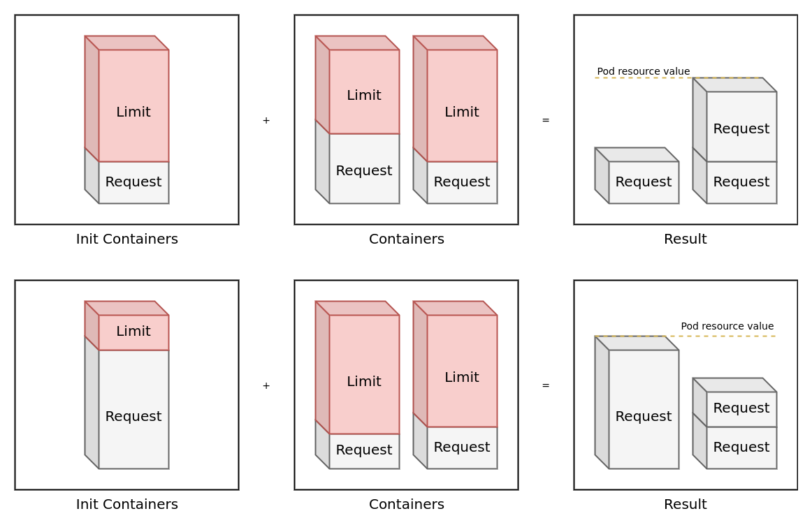

# Pod Resource
**The goal of this chapter is to understand how resources are allocated to a pod on Fargate.**

Kubernetes allows the user to define requests, a minimum amount of vCPU and memory resources that are allocated to a pod. In a traditional cluster the scheduler would use the resource request to determine which node to run the pod on. Fargate works a bit differently as it is not hampered (from the end users perspective) by nodes having limited amount of resources. Instead containers in a pod will be allocated the amount it has requested. For more information please check the [documentation](https://docs.aws.amazon.com/eks/latest/userguide/fargate-pod-configuration.html).

## Metrics Server
Before we can begin we need to deploy the [metrics-server](https://github.com/kubernetes-sigs/metrics-server) that aggregates metrics from the cluster, as it does not come by default in EKS. Give it a few seconds to start then you should be able to get node and pod metrics.
```shell
kubectl apply -k metrics-server
kubectl -n kube-system wait --for=condition=available deployment/metrics-server && kubectl top nodes
kubectl -n kube-system top pods
```

## Resource Consumer
Let's start out by deploying our pods without any resource requests or limits on Fargate. We are deploying [resource-consumer](https://github.com/kubernetes/kubernetes/tree/master/test/images/resource-consumer) which is a application that allows a user to manually trigger cpu and memory utilization in a container.
```shell
kubectl apply -k resource-consumer/base
kubectl wait --timeout 5m --for=condition=available deployment/resource-consumer
```

Resource consumer will expose an API through a load balancer. So lets get the external IP of the service and make a request. We are going to tell resource consumer to consume 700 millicores of CPU for 60 seconds. We can then watch the CPU metrics change as the usage increases. The question is will it throttle and if so when?
```shell
EXTERNAL_IP=$(kubectl get service -l app=resource-consumer -o=jsonpath="{.items[0].status.loadBalancer.ingress[0].hostname}")
curl --data "millicores=700&durationSec=60" http://$EXTERNAL_IP:8080/ConsumeCPU
watch -n 1 kubectl top pod -l app=resource-consumer
```

The CPU will probably max out below 250 millicores even when we don't set any explicit resource requests or limits, and there is a good explanation for this. Before the explanation why this is the case lets try the same thing but with resource limits. In this instance we will set the resource request for the CPU and memory to 300 millicores and 3 Gigabytes.
```yaml
resources:
  requests:
    memory: "3G"
    cpu: "300m"
```

Apply the manifests with resource request and repeat the steps like before.
```shell
kubectl apply -k resource-consumer/with_request
kubectl wait --for=condition=available deployment/resource-consumer
curl --data "millicores=700&durationSec=120" http://$EXTERNAL_IP:8080/ConsumeCPU
curl --data "megabytes=1000&durationSec=120" http://$EXTERNAL_IP:8080/ConsumeMem
watch -n 1 kubectl top pod -l app=resource-consumer
```

We now see that the CPU maxes out just below 500 millicores. Why is Fargate allocating us more resources than we requested?

**The following steps are first done by Fargate to figure out what compute configuration to use:**
* The maximum request out of any init containers is used to determine the init request vCPU and memory requirements.
* Requests for all long-running containers are added up to determine the long-running request vCPU and memory requirements.
* The larger of the above two values is chosen for the vCPU and memory request to use for your pod.
* Fargate adds 256 MB to each pod's memory reservation for the required Kubernetes components (kubelet, kube-proxy, and containerd).



After that value is calculated for both the CPU and memory it matched to one of the compute configurations in the table below. As shown it is not possible for a pod to have less than 250 millicores and 0.5 GB of resources allocated to it on Fargate. It also means that it is not possible for a pod to have 500 millicores and 0.5 GB of memory allocated to it. To fulfill the request of 500 millicores would force Fargate to chose the best fitting memory value which would be 1 GB.

| vCPU value | Memory value |
| --- | --- |
| .25 vCPU | 0.5 GB, 1 GB, 2 GB |
| .5 vCPU | 1 GB, 2 GB, 3 GB, 4 GB |
| 1 vCPU | 2 GB, 3 GB, 4 GB, 5 GB, 6 GB, 7 GB, 8 GB |
| 2 vCPU | Between 4 GB and 16 GB in 1-GB increments |
| 4 vCPU | Between 8 GB and 30 GB in 1-GB increments |

In our first test we did not set any resource requests, resulting in the pod defaulting to the lowest compute configuration (0.25 vCPU and 0.5 GB) which explains why we throttled just below 250 millicores.

In the second test we allocated 300 millicores of CPU and 3 GB of memory. We dont have any init containers to worry about and resource limits don't matter. Which means that the closest CPU configuration is .5 vCPU (or 500 millicores). The first guess would be to say 3 GB, but you have to remember that Fargate will add 256 MB to all memory requests, causing Fargate to round up to 4 GB. If we were to change the memory request to 4 GB we would round up to 5 GB forcing us to pay for 1 vCPU as there is no combination of 0.5 vCPU and 5 GB.

## Memory Limits
If resource limits are ignored what happens when we surpass our memory request? Lets try to consume 5 GB of memory knowing that our pod will only have 4 GB availible to it, and see what happens.
```shell
curl --data "megabytes=5000&durationSec=30" http://$EXTERNAL_IP:8080/ConsumeMem
watch -n 1 kubectl top pod -l app=resource-consumer
```

We should see that the metrics collection fails and the pod has been restarted. This type of behavior is similar to how resource limits work in "normal" worker nodes. When a pod passes its limit it will be restarted.
```shell
kubectl get pods -l app=resource-consumer -o=jsonpath='{"restart-count: "}{.items[*].status.containerStatuses[*].restartCount}'
```

Understanding the resource allocation behavior of EKS on Fargate is important as you will be paying for the compute configuration allocated in Fargate, not what you have requested in Kubernetes. So if you request 100 millicores for your pod you will still pay for the minimum compute configuration which is 250 millicores in Fargate. This also means that a init container that makes large resource requests will set the compute configuration and price for the pods long running containers. For more information about pricing please refer to [Fargates pricing documentation](https://aws.amazon.com/fargate/pricing/).

You should now know how pod resource allocation works on EKS fargate. Make sure to remove the resource consumer before going on to the next chapter.
```shell
kubectl delete deployment resource-consumer && kubectl delete service resource-consumer
```

[Next Chapter](../4_autoscaling)

